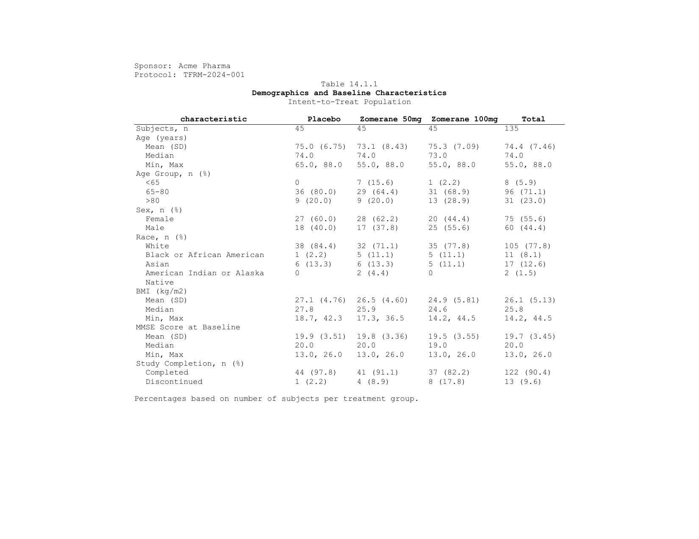

```{r setup, include = FALSE}
knitr::opts_chunk$set(collapse = TRUE, comment = "#>")
library(tlframe)
```

## Titles

Each argument to `fr_titles()` is one title line, centered by default:

```{r titles-basic}
spec <- tbl_demog |>
  fr_table() |>
  fr_titles(
    "Table 14.1.1",
    "Demographics and Baseline Characteristics",
    "Intent-to-Treat Population"
  )
length(fr_get_titles(spec))
```

Calling `fr_titles()` again **replaces** all previous titles.

> **SAS:** `TITLE1 "Table 14.1.1"; TITLE2 "Demographics...";`

### Styled titles

Pass a named list to control alignment and bold per line:

```{r titles-styled}
spec <- tbl_demog |>
  fr_table() |>
  fr_titles(
    list("Sponsor: Acme Pharma", align = "left"),
    list("Protocol: TFRM-2024-001", align = "left"),
    "Table 14.1.1",
    list("Demographics and Baseline Characteristics", bold = TRUE),
    "Intent-to-Treat Population"
  )
length(fr_get_titles(spec))
```

```{r titles-styled-preview, echo = FALSE, out.width = "100%", fig.cap = "Mixed alignment with selective bold titles"}

```

List fields: `align` (`"left"`, `"center"`, `"right"`), `bold` (logical),
`font_size` (numeric).

### Default styling

`.align` and `.bold` set defaults for all lines:

```{r titles-defaults}
spec <- tbl_demog |>
  fr_table() |>
  fr_titles(
    "Table 14.1.1",
    "Demographics and Baseline Characteristics",
    .bold = TRUE, .align = "center"
  )
fr_get_titles(spec)[[1]]$bold
```

## Footnotes

```{r fn-basic}
spec <- tbl_demog |>
  fr_table() |>
  fr_footnotes(
    "Percentages based on number of subjects per treatment group.",
    "MMSE = Mini-Mental State Examination.",
    .separator = FALSE
  )
length(fr_get_footnotes(spec))
```

| Option | Default | Description |
|--------|---------|-------------|
| `.separator` | `FALSE` | Draw a horizontal separator rule above footnotes |
| `.placement` | `"every"` | `"last"` = last page only (PDF only; RTF repeats all) |
| `.align` | `"left"` | Footnote text alignment |

> **SAS:** `FOOTNOTE1 "Percentages...";`

## Inline markup

Use `{fr_*()}` expressions inside any text string --- titles, footnotes,
column labels, data cells:

```{r markup-demo}
spec <- tbl_demog |>
  fr_table() |>
  fr_footnotes(
    "{fr_super('a')} Fisher's exact test.",
    "{fr_super('b')} Cochran-Mantel-Haenszel test.",
    "BMI = Body Mass Index (kg/m{fr_super(2)})."
  )
fr_get_footnotes(spec)[[3]]$content
```

### Markup reference

| Function | Output | Use case |
|----------|--------|----------|
| `fr_super(x)` | Superscript | Footnote markers, units (`"m{fr_super(2)}"`) |
| `fr_sub(x)` | Subscript | Chemical formulas (`"H{fr_sub(2)}O"`) |
| `fr_bold(x)` | **Bold** | Inline emphasis (`"{fr_bold('Total')} Subjects"`) |
| `fr_italic(x)` | *Italic* | P-value annotations (`"{fr_italic('P')}-value"`) |
| `fr_underline(x)` | Underline | Highlighting (`"{fr_underline('CONFIDENTIAL')}"`) |
| `fr_newline()` | Line break | Multi-line cells (`"Treatment{fr_newline()}Arm"`) |
| `fr_dagger()` | Dagger (U+2020) | Treatment-related AE markers |
| `fr_ddagger()` | Double dagger (U+2021) | Serious AE markers |
| `fr_emdash()` | Em dash (U+2014) | Title clauses (`"Safety {fr_emdash()} FAS"`) |
| `fr_endash()` | En dash (U+2013) | Numeric ranges (`"18{fr_endash()}65 years"`) |
| `fr_unicode(code)` | Unicode char | Plus-minus (`fr_unicode(0x00B1)`), degree, etc. |

### Markup in column labels

```{r markup-col}
spec <- tbl_demog |>
  fr_table() |>
  fr_cols(
    placebo = fr_col("{fr_bold('Placebo')}")
  )
```

### Markup in data cells

Markup works anywhere a string appears, including the data itself:

```{r markup-cell}
d <- data.frame(stat = "P{fr_super('a')}-value", val = "<0.001",
                stringsAsFactors = FALSE)
spec <- d |>
  fr_table() |>
  fr_cols(
    stat = fr_col("Statistic", width = 2),
    val  = fr_col("Result", width = 1.5)
  )
```

The sentinel tokens survive `paste()`, `sprintf()`, and `glue()` ---
they are resolved per-backend at render time.
